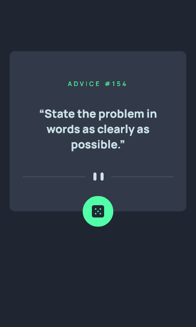
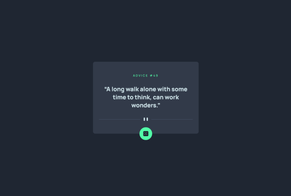
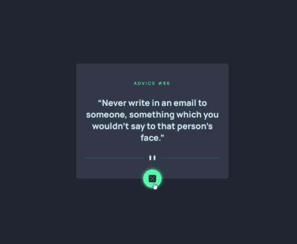

# Frontend Mentor - Advice generator app solution

This is a solution to the [Advice generator app challenge on Frontend Mentor](https://www.frontendmentor.io/challenges/advice-generator-app-QdUG-13db). 

## Table of contents

- [Overview](#overview)
  - [The challenge](#the-challenge)
  - [Screenshot](#screenshot)
  - [Links](#links)
- [My process](#my-process)
  - [Built with](#built-with)
  - [What I learned](#what-i-learned)
  - [Useful resources](#useful-resources)
- [Author](#author)


## Overview

### The challenge

The challenge consist in building an advice generator app using the [Advice Slip API](https://api.adviceslip.com/).

Users should be able to:

- View the optimal layout for the app depending on their device's screen size
- See hover states for all interactive elements on the page
- Generate a new piece of advice by clicking the dice icon

### Screenshots

- mobile device

<p align="center">
 
 </p>

 - desktop


<p align="center">
 
 </p>


 - desktop active state

<p align="center">
 
 </p>

### Links
- Live Site URL: [https://aleperf.github.io/advice-generator-app](https://aleperf.github.io/advice-generator-app)

## My process

### Built with

- Semantic HTML5 markup
- CSS, SASS
- Flexbox
- Mobile-first workflow
- [React](https://reactjs.org/) - JS library
- [Axios library](https://axios-http.com/)


### What I have learned
 Differences between Chrome and Firefox requesting the same endpoint multiple times, using the axios library.


>When clicking on the dice button, the user should see a new advice every time,  if the button is clicked at least two seconds after the previous request, differently the API will give the same advice: it is a built-in feature of the API itself, so a random double click won't reload another advice too soon, avoiding a bad user experience.

>In theory there is no need to differentiate the requests to the API, because the API will serve a new random quote for every new request, when adequately spaced in time.

>Nonetheless querying the [Advice Slip API](https://api.adviceslip.com/) can give different results in Firefox, respect to Chrome when performing a query to the same endpoint clicking the button: Chrome will reload a new query as expected, while Firefox will use the cached result of the query, so a click on the button won't give any new advice, a default behavior useful for avoiding unnecessary network requests: most of the APIs usually give different results only for different endpoints.

>A simple way to overcome the default behavior of Firefox using axios consists in adding a different optional parameter to the request, so every new request will be different from the previous one; a good option is using  a timestamp as below:


```js
const response = await axiosInstance.get(sentenceId, { params: {
    t: new Date().getTime()
  }});

```


### Useful resources

- [Using JavaScript Axios/Fetch. Can you disable browser cache?](https://stackoverflow.com/questions/49263559/using-javascript-axios-fetch-can-you-disable-browser-cache) - A useful Stack Overflow post on how to solve the problem of caching, when requesting the same endpoint on Firefox.


## Author

- My Github - [https://github.com/aleperf](https://www.your-site.com)


